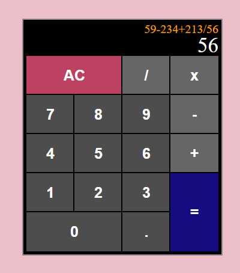
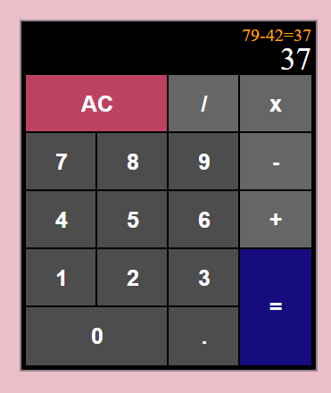
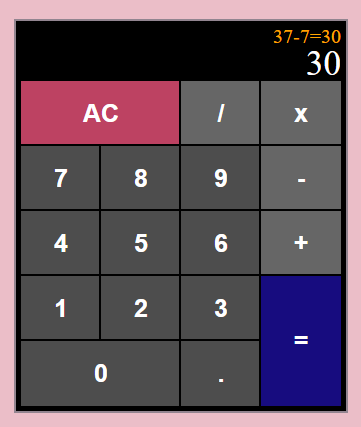

# JavaScript Calculator

It's your usual Calculator App, but with a bit more advanced display for your equations and being able to chain equations together, made in JavaScript plus React.

## Contents

- [Features](#features)
- [Installation](#installation)
- [Functionality and Screenshots](#functionality-and-screenshots)
- [Credits](#credits)

## Features

- It's your every day calculator.
- After pressing equals, inputting an operator will continue your equation.
- Clear screen button.
- A second display area to show your entire equation so far.
- Combining divide, multiply and add operators with the minus operator (for negative numbers).

## Installation

In the project directory, you can run:

### `npm start`

Runs the app in the development mode.\
Open [http://localhost:3000](http://localhost:3000) to view it in your browser.

The page will reload when you make changes.\
You may also see any lint errors in the console.

### `npm test`

Launches the test runner in the interactive watch mode.\
See the section about [running tests](https://facebook.github.io/create-react-app/docs/running-tests) for more information.

### `npm run build`

Builds the app for production to the `build` folder.\
It correctly bundles React in production mode and optimizes the build for the best performance.

The build is minified and the filenames include the hashes.\
Your app is ready to be deployed!

See the section about [deployment](https://facebook.github.io/create-react-app/docs/deployment) for more information.

### `npm run eject`

**Note: this is a one-way operation. Once you `eject`, you can't go back!**

If you aren't satisfied with the build tool and configuration choices, you can `eject` at any time. This command will remove the single build dependency from your project.

Instead, it will copy all the configuration files and the transitive dependencies (webpack, Babel, ESLint, etc) right into your project so you have full control over them. All of the commands except `eject` will still work, but they will point to the copied scripts so you can tweak them. At this point you're on your own.

You don't have to ever use `eject`. The curated feature set is suitable for small and middle deployments, and you shouldn't feel obligated to use this feature. However we understand that this tool wouldn't be useful if you couldn't customize it when you are ready for it.

## Functionality and Screenshots

*Calculator - Expected Display*

Illustrating what the calculator looks like (the rest of the page is the pink background colour).
- The orange text is your entire equation typed so far. You can chain as many numbers and operators as you want.
- The white display is the current number you are typing. As expected, this number can only have one decimal point.
- The AC button clears the display.
- The rest of the display is self-explanatory. The pictures below will illustriate what happens if you press equals.

*Calculator - Equals Button*

The two images above illustrate pressing the equals button.
- Upon clicking equals (in the left hand picture), the answer 37 is produced and the full equation is displayed in the orange text display as well as the white text display.
- From there, the minus operator is clicked followed by a 7 seen in the right hand picture, then the equals button is pressed.
- This is illustration that you are able to chain equations together, and don't need to start over by typing in your last answer.

## Credits

### Tools

- JavaScript
- React
- SCSS
- HTML

[Back to Top](#contents)
